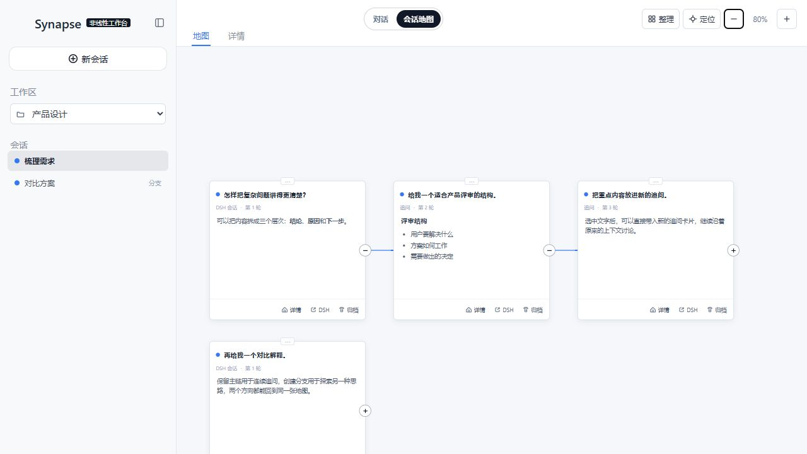

# dsh-synapse


**A visual, non-linear conversation workspace plugin for DeepSeek Harness.**

把同一工作区里的会话、追问与分支变成一张可浏览、可拖拽、可放大的对话地图，同时保留 DSH 原生的对话能力。

[中文](#中文) | [English](#english)



---

## 中文

### 简介

`dsh-synapse` 是一个独立的 DeepSeek Harness Web 插件。它不替代 DSH 的模型、工具、会话或权限逻辑，而是在原生对话界面上增加一个可视化工作台，将同一工作区内的会话、追问和分支呈现为可浏览的对话地图。

复杂任务往往不是一条直线：你需要保留某个方案、回到第二轮问题尝试另一条路径，或在多个会话之间快速定位上下文。Synapse 让这些关系留在同一张画布上，同时继续使用 DSH 原有的会话能力。

### 功能特性

| | 功能 | 说明 |
|---|---|---|
| 🗺️ | 会话地图 | 在 DSH 原生对话与可视化画布之间切换 |
| 🌿 | 分支可见 | 通过 DSH 原生 session fork 创建分支，并按真实分叉点连接节点 |
| 📁 | 工作区映射 | 读取 DSH 工作区与目录归属，便于在正确的项目上下文中创建会话 |
| 📥 | 持续投影 | 用户消息和助手回复投影到对应卡片；流式回复在详情中持续更新 |
| 🔧 | 工具过程折叠 | 工具调用与结果按 `callId` 配对，折叠进对应助手回复卡，不再单独成卡 |
| ⚡ | 会话同步 | 原生对话与会话地图双向同步当前会话——任一侧切换，另一侧跟随高亮 |
| 🎨 | 画布交互 | 拖动画布、缩放视图（最高 4×）、移动卡片（位置自动保存）、展开/折叠后续对话子树、一键定位当前会话，卡片内平滑滚动 |
| 🔒 | 原生会话不变 | 打开、追问、创建和归档仍由 DSH 会话系统完成；Synapse 只提供另一种查看与组织方式 |


### 快速开始

```powershell
corepack pnpm dsh plugin --profile web add github:liangmianya/dsh-synapse
corepack pnpm dsh web
```

打开 `http://127.0.0.1:3080/`，点击顶部"会话地图"即可进入。

### 安装

前提：已安装支持 `dsh plugin` profile 插件机制的 DeepSeek Harness（2026-08 及之后版本），且 Node.js 版本不低于 `22.19`。

> [!NOTE]
> 本插件**仅支持 `web` profile**：它的 patch 只向 Web 组合插入自身，复用 DSH 现有 Web 服务，不启动第二个应用进程。

#### 从 GitHub 安装

```powershell
corepack pnpm dsh plugin --profile web add github:liangmianya/dsh-synapse
```

GitHub 安装会执行本项目的 `prepare` 脚本（`node --check` 语法校验）。

> [!IMPORTANT]
> pnpm ≥10 默认阻止 git 依赖的构建脚本。若安装被拦截，请把 **pnpm 打印的确切键**（包名加其拉取的 tarball 地址，内含 commit，**不是裸包名**）复制进 DSH profile 的 `pnpm-workspace.yaml`：

```yaml
allowBuilds:
  "dsh-synapse@https://codeload.github.com/liangmianya/dsh-synapse/tar.gz/<commit>": true
```

然后重新执行安装命令。在 pnpm 10.x 上裸包名匹配不到 git 依赖；上游推送新 commit 后该键会变化，届时复制 pnpm 新打印的键即可。

#### 本地开发安装

```powershell
corepack pnpm dsh plugin --profile web add link:E:\path\to\dsh-synapse
```

`link:` 形式会直接链接你的本地 checkout，改代码即时生效。

#### 启动

```powershell
corepack pnpm dsh web                # 默认 http://127.0.0.1:3080
corepack pnpm dsh web --port 0       # 3080 被占用时，自动分配空闲端口
```

### 卸载

```powershell
corepack pnpm dsh plugin --profile web remove dsh-synapse
```

> [!NOTE]
> `remove` 只移除插件依赖与 profile 激活层，**不会删除画布数据**（`$DSH_HOME\synapse\workspaces.json`）。重装后旧数据会自动迁移恢复。
>
> 彻底清理：手动删除 `$DSH_HOME\synapse\` 目录；`pnpm-workspace.yaml` 中残留的 allowBuilds 键无害，可一并删掉。

### 配置

插件通过 profile 的 `cordis.patch.yml` 注入，以下键可在你自己的 patch 中按行 id `synapse` 覆盖（整体替换 `config`）：

| 键 | 默认值 | 说明 |
|---|---|---|
| `dataFile` | `$DSH_HOME/synapse/workspaces.json` | 画布元数据持久化路径 |
| `autoProjection` | `true` | 是否自动把已提交的 DSH 会话事件投影为画布卡片 |
| `projectionWorkspaceTitle` | `DSH 任务` | 投影工作区的标题 |
| `trustedHosts` | `[]` | 额外放行的 Host（主机名或 主机:端口）；`localhost` 与 `127.0.0.1` 始终放行。局域网访问需在此加入你的主机 |

```yaml
# 在 profile 的 cordis.patch.yml 中覆盖（需重述全部键）
- id: synapse
  config:
    dataFile: !!js dshHomePath('synapse/my-workspaces.json')
    autoProjection: true
    projectionWorkspaceTitle: 我的任务
```

### 使用方式

1. 在 DSH 中选择工作目录，或打开一个已有会话。
2. 点击顶部"会话地图"进入画布。
3. 浏览画布卡片：点击卡片或侧边栏会话即可切换当前会话（原生页同步跟随）；"分支"操作保留一条替代路径。
4. 点击卡片底部"详情"查看完整对话记录；点击顶部"对话"切换或卡片"在 DSH 中打开"，回到原生对话。

### 数据与边界

- 画布元数据保存在 DSH Home 的 `synapse/workspaces.json`（当前 schema v4，自动迁移旧版数据）。
- 单条消息投影上限 **8000 字符**，超出截断并标注"—…（详情查看全文）"。
- 会话内容仍由 DSH session log 保存和管理。
- 本插件不启动第二个 Web 服务、不创建第二套 Agent，也不改变 DSH 的模型或工具执行行为。

### 模型影响

无直接模型影响：插件只读取**已提交**的会话事件并渲染成画布，不向任何模型请求添加系统提示、工具 schema 或请求上下文，也不影响 KV 缓存复用。

### 已知限制与后续

- 仅支持 `web` profile。
- 画布元数据与会话日志分离：删除 `workspaces.json` 会丢失画布布局与分支锚点，但不会丢失会话。
- 两个 `dsh web` 实例共享同一 profile 时会写同一个 `workspaces.json`：运行时已加跨进程写锁与外部修改警告，但最后写入覆盖的风险仍在——请只运行单个实例。
- 旧版（v3）数据迁移时工具卡片按**顺序**配对（每条调用配下一条结果）；实时事件按 `callId` 配对。

---

## English

`dsh-synapse` is a standalone DeepSeek Harness Web plugin. It does not replace DSH models, tools, sessions, or permissions. Instead, it adds a visual workspace on top of the native conversation UI, turning related sessions, follow-ups, and forks into an explorable conversation map.

Complex work is rarely linear. You may need to preserve one approach, return to an earlier turn, and explore another path without losing context. Synapse keeps those relationships on one canvas while leaving DSH's native session behavior intact.

### Features

| | Feature | Description |
|---|---|---|
| 🗺️ | Session map | Switch between the native DSH chat and a visual canvas |
| 🌿 | Visible branches | Create forks through DSH native session forks and connect them at their actual branching turn |
| 📁 | Workspace-aware | Reflect DSH workspaces and directory ownership when creating or browsing sessions |
| 📥 | Live projection | Project user messages and assistant replies into cards, with streaming updates in the detail view |
| 🔧 | Folded tool process | Tool calls and results pair by `callId` and fold into the assistant reply card instead of becoming standalone cards |
| ⚡ | Session sync | The native chat and the session map sync the current session bidirectionally — switching on either side highlights the other |
| 🎨 | Canvas interaction | Pan, zoom (up to 4×), move cards (positions persist), expand or collapse descendant subtrees, one-click focus on the current session, and smooth scrolling inside each card |
| 🔒 | Native sessions stay native | Opening, prompting, creating, and archiving sessions remains DSH-owned; Synapse only changes how they are viewed and organized |

### Quick start

```powershell
corepack pnpm dsh plugin --profile web add github:liangmianya/dsh-synapse
corepack pnpm dsh web
```

Open `http://127.0.0.1:3080/` and use the top "Session Map" switch.

### Installation

Prerequisites: a DeepSeek Harness with the `dsh plugin` profile plugin mechanism (2026-08 or later) and Node.js `>= 22.19`.

> [!NOTE]
> This plugin **only supports the `web` profile**: its patch inserts into the Web composition and reuses the existing DSH server rather than running a second application process.

#### Install from GitHub

```powershell
corepack pnpm dsh plugin --profile web add github:liangmianya/dsh-synapse
```

GitHub installs run this package's `prepare` script (`node --check` syntax validation).

> [!IMPORTANT]
> pnpm ≥10 blocks a git dependency's build scripts until explicitly allowed. If the install is blocked, copy the **exact key pnpm printed** — the package name plus its fetched tarball URL, which embeds the commit, **not the bare package name** — into the DSH profile's `pnpm-workspace.yaml`:

```yaml
allowBuilds:
  "dsh-synapse@https://codeload.github.com/liangmianya/dsh-synapse/tar.gz/<commit>": true
```

Then rerun the install command. On pnpm 10.x a bare package name does not match a git-hosted dependency; the key changes when the upstream repository pushes a new commit, so copy the newly printed key then.

#### Install a local checkout

```powershell
corepack pnpm dsh plugin --profile web add link:E:\path\to\dsh-synapse
```

The `link:` form points at your local checkout, so edits take effect immediately.

#### Boot

```powershell
corepack pnpm dsh web                # default http://127.0.0.1:3080
corepack pnpm dsh web --port 0       # pick a free port when 3080 is taken
```

### Uninstall

```powershell
corepack pnpm dsh plugin --profile web remove dsh-synapse
```

> [!NOTE]
> `remove` only removes the dependency and the profile activation layer; it does **not** delete canvas data (`$DSH_HOME\synapse\workspaces.json`). Reinstalling restores and migrates the old data.
>
> For a full cleanup, manually delete the `$DSH_HOME\synapse\` directory; the leftover allowBuilds key in `pnpm-workspace.yaml` is harmless and can also be removed.

### Configuration

The plugin is injected through the profile's `cordis.patch.yml`. Override any key in your own patch by targeting the row id `synapse` (the whole `config` is replaced):

| Key | Default | Description |
|---|---|---|
| `dataFile` | `$DSH_HOME/synapse/workspaces.json` | Canvas metadata persistence path |
| `autoProjection` | `true` | Automatically project committed DSH session events into canvas cards |
| `projectionWorkspaceTitle` | `DSH 任务` | Title of the projection workspace |
| `trustedHosts` | `[]` | Extra authorities (host or host:port) the `/synapse` Host check accepts; `localhost` and `127.0.0.1` are always allowed. LAN access must add your host here |

```yaml
# Override in the profile's cordis.patch.yml (restate every key)
- id: synapse
  config:
    dataFile: !!js dshHomePath('synapse/my-workspaces.json')
    autoProjection: true
    projectionWorkspaceTitle: My tasks
```

### Usage

1. Select a working directory or open an existing DSH session.
2. Open "Session Map" from the top switch.
3. Browse the canvas: clicking a card or a sidebar session switches the current session (the native page follows); the "branch" action keeps an alternative path.
4. Open "Details" at the bottom of a card for the full conversation; return to the native chat with the top "Dialogue" switch or a card's "Open in DSH" button.

### Data and scope

- Canvas metadata is stored in `synapse/workspaces.json` under DSH Home (schema v4, old data migrates automatically).
- Projected messages are capped at **8000 characters**; longer replies truncate with a "—…（详情查看全文）" marker.
- DSH remains the owner of session-log content.
- This plugin starts no second web server, creates no second agent, and does not modify model or tool execution.

---

## Development

```powershell
corepack pnpm install
corepack pnpm run build
corepack pnpm test
corepack pnpm pack
```

`npm pack --dry-run --json` is useful for reviewing the files that will be published before creating a release archive.

### CI and npm releases

GitHub Actions runs the full build and test suite for pull requests targeting `main` and for every push to `main`.

Tag pushes matching `vMAJOR.MINOR.PATCH` or `vMAJOR.MINOR.PATCH-prerelease` test and publish the package to npm. The tag version must exactly match `package.json.version`:

- `package.json.version` `0.4.0-rc1` with tag `v0.4.0-rc1` publishes with the npm `next` dist-tag.
- `package.json.version` `0.4.0` with tag `v0.4.0` publishes with the npm `latest` dist-tag.

Before enabling release publishing, add a GitHub Actions repository secret named `NPM_TOKEN`. The token's npm account must be allowed to create or publish the public, unscoped `dsh-synapse` package.

## License

[MIT](LICENSE)

## Model Experience

None, as dsh-synapse only reads committed session events and renders them; it adds no system-prompt prose, tool schemas, or request-context content to any model request.

### KV Cache effect

Does not invalidate. The plugin never changes request headers, system prompts, or tool registries, so an already-reusable KV prefix stays reusable; canvas projection consumes session logs only after they are committed.

## Known Limitations and Deferred Work

- Only the `web` profile is supported; the patch inserts into the web composition and no other profile template declares it.
- Canvas metadata is separate from session logs: deleting `workspaces.json` loses canvas layout and fork anchors, never conversations.
- Two `dsh web` instances sharing one profile write the same `workspaces.json`: a cross-process write lock and external-modification warnings are in place, but last-writer-wins clobbering remains possible — run a single instance.
- Legacy v3 data migrates tool cards by order (each call paired with the next result); live events pair by `callId`.
